# **Learn Augmented Reality with Spark AR & Pirate Dash 360**

## Create an Augmented Reality Puzzle Using Spark AR World Effect, through Pirate Dash 360!

<div>
    <p align="center">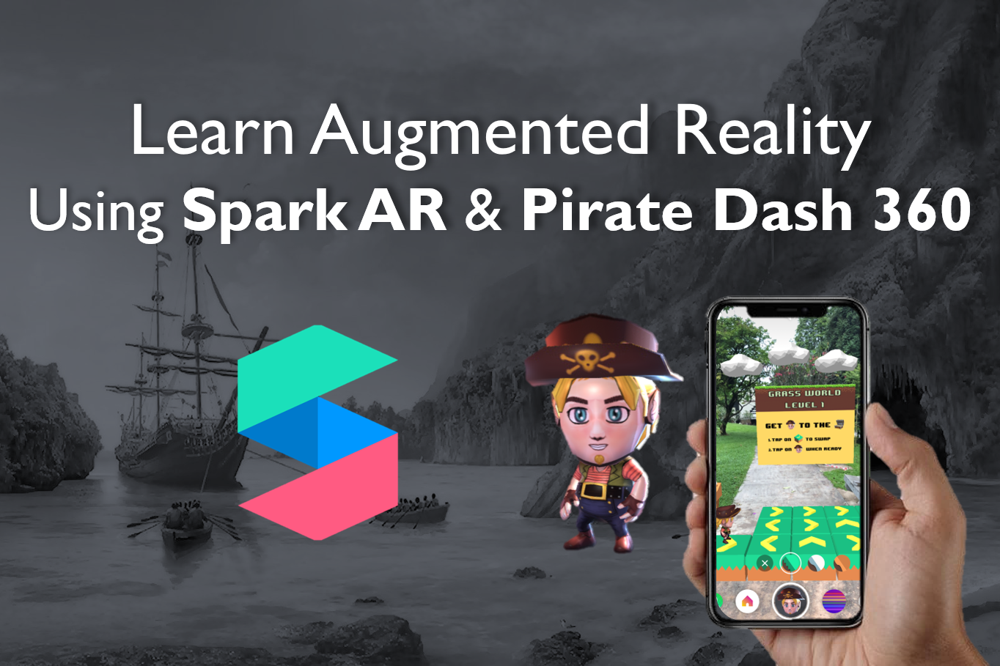</p>
    <p align="center"><i>Submission for Facebook Developer Circles Community Challenge</i></center>
    <p align="center">
    Team Members: <a href="https://github.com/gabrielkzm">Gabriel Koh</a>, <a href="https://github.com/ngrq123">Ng Rui Qin</a>, <a href="https://github.com/yankai364">Ong Yan Kai</a>, <a href="https://github.com/vncnttkkk">Vincent Tok</a>
    </p>
</div>

## 1. **Introduction**

Always wanted to create an immersive Instagram game effect, but not sure how to? We will show you the way! This tutorial will guide you on how to create an Augmented Reality (AR) puzzle game using the Spark AR Studio - no experience required.

It can be daunting to learn a new technology or software, especially for cutting edge technology such as AR. Fret not, we all start somewhere! For us, our journey and foray into this space only commenced during the competition period of the Facebook AR Hackathon, and if we can do it, so can you! 

### **1.1. What Are We Building**

We will be re-creating a puzzle game that we did for the Facebook AR Hackathon, called [Pirate Dash 360](https://devpost.com/software/pirate-dash-360). It is an immersive 360° AR puzzle platformer game filter that utilizes the phone's back-facing camera. Players guide the pirate to the treasure by swapping directional tiles. 

> Note: We will be creating a simplified, one-level version of Pirate Dash 360.
 
<p align="center">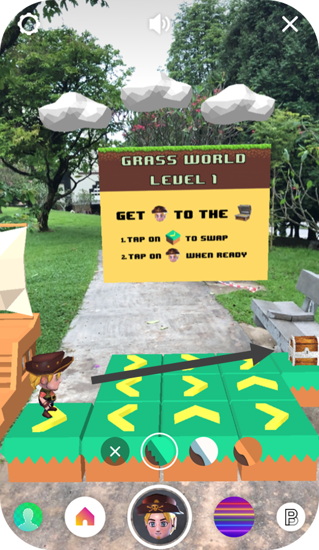</p>

### **1.2. Key Concepts Covered**

Through this tutorial, you will learn how to:
- Utilize various features of Spark AR Studio
- Import and customize game assets using Spark AR Studio
- Augment game environment using Spark AR Studio and JavaScript
- Add animations using Spark AR Studio and JavaScript

## 2. **Before We Start**

### **2.1. Knowledge Prerequisites**
- Javascript: https://javascript.info, https://www.json.org/json-en.html

Basic JavaScript knowledge is recommended for this tutorial as it is required for scripting of animations and setting up the scene for the game. Within JavaScript, JavaScript Object Notation (JSON) is a data format which can be used to define the structure of the game. In **Pirate Dash 360**, it is used to define the tiles required for each level.

### **2.2. Software Prerequisites**
- **Spark AR Studio v98**: https://sparkar.facebook.com/ar-studio/download
- **A code editor**, such as Visual Studio Code: https://code.visualstudio.com/download 

### **2.3. Getting Started**
<p align="center">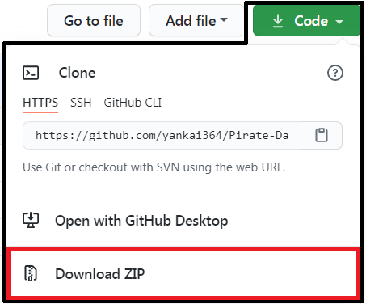</p>

To get started, download this repository by selecting **Download ZIP** and save it to a familiar location. Open the **starter** folder.

### **2.4. Understanding Starter Project**
[TODO: include file structure pic and explanation]

With a good understanding of the pre-starter project, we can now begin!

## 3. **Part 1: Importing and Customizing Game Assets**
---
We will proceed to import and customize the game assets in the Spark AR environment. To simplify this process, please refer to the `/starter/objects` folder for all the relevant game assets that you would require for this section. 

> The objective of this section is to prepare the static assets for subsequent feature implementation i.e creating the augmented environment, implementing game logic and so on. 

### **3.1. Placing Tiles and Pirate in World View**

First, we need to import the relevant assets into Spark AR Studio.

<details><summary>Show Instructions</summary>

1. Open Spark AR Studio.
   
2. On the left navigation pane, click **Open** and open `/starter/starter.arproj` to open the project.
   
3. From here you can view the Scene environment that we will be working with. Proceed to import the pirate object:
   
4. Click **+Add Asset** on the bottom left of the side navigation drawer, followed by **Import From Computer....** Select file `/starter/objects/pirate/scene.gltf` to import the Pirate asset.
   
5. Repeat Step 3 for `/treasure-chest/chest-anim.fbx`, `/tile/blockHalf.fbx` and `/directions/scene.gltf` under `/starter/objects` to import tiles, directions and treasure assets. You should see the following:

<p align="center">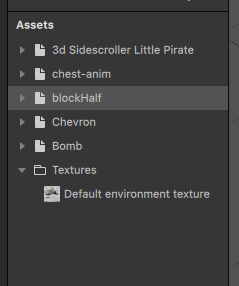</p>

6. Next, drag the **3d Sidescroller Little Pirate** (pirate), **chest-anim** (treasure chest), **blockHalf** (tile), **Chevron** (direction) from the **Assets** category into the **Plane Tracker planeTracker0**. You should be able to see the following:

<p align="center">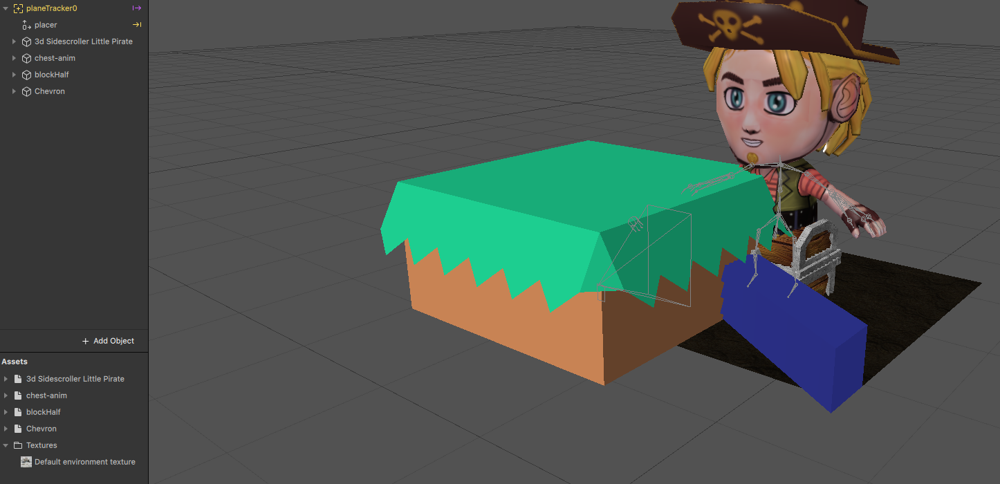</p>

</details>

### **3.2. Resizing Objects**

Now that we have all our assets placed into the Scene environment via the Plane Tracker, the next thing we want to do is to re-size them.

<details><summary>Show Instructions</summary>

1. Proceed to click on **3d Sidescroller Little Pirate** under **planeTracker0**, you will see a navigation pane showing up on the right hand side of Spark AR Studio. You may adjust the size of the 3D object via the **x, y, z** coordinates under **Scale** section. For the pirate object, kindly use the following coordinate values: **x = 0.07, y = 0.07, z = 0.07**.

2. Do the following for the **chest-anim**, **blockHalf**, and **Chevron** object, based on the coordinates given below:

    Asset | x | y | z
    ------------ | ------------- | ------------- | -------------
    blockHalf | 1 | 1 | 1
    Cheveron | 0.5 | 0.7 | 0.5
    chest-anim | 1.21876 | 1.36885 | 1.09586

    Afterwhich, you should be able to see the following:

<p align="center">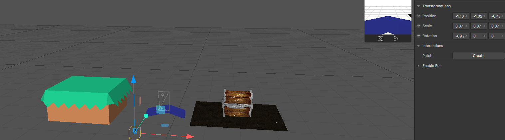</p>

*Size of all assets changed, however, only properties of pirate can be seen in the screenshot.*

</details>

### **3.3. Changing the Texture**

Finally, we are done with placing and resizing our assets. To opt for your very own design, you can choose to whichever texture and color you prefer. In order to change the textures, select the object under **Assets**. You will notice the right navigation pane showing, proceed to choose from the available textures and colors under **Albedo**. For this tutorial, we will proceed to change the color of **direction** to yellow.

<details><summary>Show Instructions</summary>

1. Click on **Chevron → Scene_-_Root** under **Assets**.
2. Under **Albedo → Texture**, click the dropdown and remove any texture.
3. Click **Color**, and select a color of your preference, in the project, we decided on Yellow.

</details>

### **3.4. Creating Different Directions for Cheverons (Up, Left, Right)**

As our current **Chevron** is only oriented in one direction, we need to create three different chevrons with different orientations. We can do this by adjusting its rotation.

<details><summary>Show Instructions</summary>

1. Start off by renaming **Chevron** under **planeTracker0** to **chevron_up**.
2. Make two more copies of **chevron_up** and rename it to **chevron_right**, **chevron_left**.
3. Click on **chevron_up**, in the right navigation bar, adjust values in **Rotation**: **x = -90, y = 0, z = -179**.
4. Repeat *Step 3* for **chevron_right** and **chevron_left** using the details from the following table.

    Asset | x | y | z
    ------------ | ------------- | ------------- | -------------
    chevron_right | 90 | -90 | -180
    chevron_left | -90 | -90 | -180

    You should be able to see the following:
<p align="center">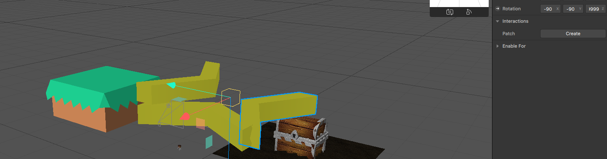</p>

*Rotations of all assets changed, however only properties of chevron_left can be seen in screenshot.*

</details>

### **3.5. Grouping Objects, Organizing Structure and Final Adjustments**

This section encompasses the concept of grouping different objects together, as well as organizing them in the correct structure. You may have noticed that certain objects like the Pirate are in fact a group of objects. In this tutorial, we need to group tiles with directions, as well as tiles with treasure.

<details><summary>Show Instructions</summary>

1. Right click **planeTracker0**, select **Add** and click **Create a Null Object**, naming it **level1**.
2. Make a copy of **blockHalf**.
3. Rename **blockHalf** to **tile1** and drag the **chevron_right** object into **tile1**.
4. Rename **blockHalf0** to **blockHalf**
5. Drag **tile1** into **level1**
6. Adjust **tile1** **Scale** to **x = 0.09, y = 0.12, z = 0.09**.
7. Adjust **tile1 → chevron_right Scale** to **0.5**, **0.7** and **0.5** for **x**, **y** and **z** respectively.
8. Adjust **tile1 → chevron_right Position** to **-0.27349**, **0.71012** and **0.85518** for **x**, **y**, and **z** respectively. 
9. Repeat *Steps 2 to 8* for **chevron_up** and **chevron_left**, naming them **tile3** and **tile5** respectively, instead of **tile1** for *Step 4*. Refer to the details for the different positions for *Step 8* based on the table below:

    Assets | x | y | z
    ------------ | ------------- | ------------- | -------------
    chevron_up | -0.82373 | 0.89036 | 0.28953
    chevron_left | -1.312 | 0.88182 | 0.85518

1.  Repeat *Steps 2 to 8* for **chest-anim**, naming it **tileEnd** instead of **tile1** for *Step 4*. Refer to the following for values on *Step 7, 8*:
    
    Properties | x | y | z
    ------------ | ------------- | ------------- | -------------
    Scale | 1.21876 | 1.36885 | 1.09586
    Position | -0.7808 | 0.71012 | 0.85518

2.  Navigate to **tileEnd → chest-anim** and delete the **Sand** object.
3.  Rename **chest-anim** to **treasure**.
    
You should be able to see the following:
<p align="center">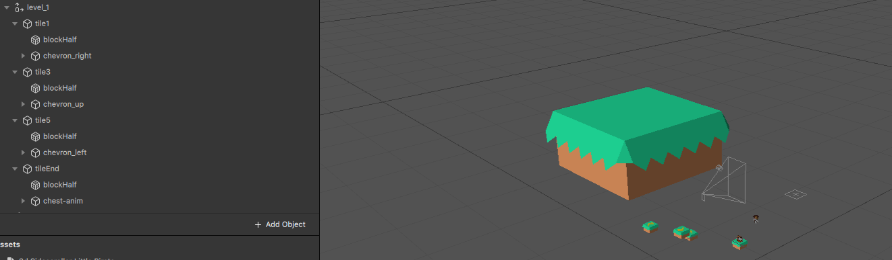</p>

13. Make duplicates of relevant tiles and rename them accordingly to conclude this section, before moving to augmenting the environment with javascript. Refer to the table below for the finalized details on duplication and renaming of tiles.
    
    Tile Name | Chevron Type/Treasure in Tile
    ------------ | -------------
    tile1 | chevron_right
    tile2 | chevron_right
    tile3 | chevron_up
    tile4 | chevron_up
    tile5 | chevron_left
    tile6 | chevron_left
    tile7 | chevron_right
    tile8 | chevron_right
    tile9 | chevron_right
    tileStart | chevron_right
    tileEnd | treasure

14. Rename **3d Sidescroller Little Pirate** to **pirate**.
    
15. Drag **pirate** into **level1**.
    
16. Delete **blockHalf**.
    
17. Change the coordinates of **level1** to **x = 0, y = 0.3, z = -1**. Do note that the positioning of the objects within the scene does not matter at this point in time *(it is okay to see objects all over the place in the scene)*.
    
You should be able to see the following:
<p align="center">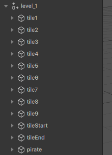</p>

18.  Finally, under **Assets → chest-anim**, delete the following: **Hole, Sand, Texture 1, 2, 4, 5, 6, 7, 8, 9, 12, 13**. This is done to shrink the project size, abiding by size restrictions for publishing of game in the later stages.

</details>

## 4. Part 2: Creating the Augmented Environment

Now that we have added the objects to our AR environment, it is time to position them to create our first game level! 

> The objective of this section is to learn how to create the augmented environment by rendering objects, adding user interactions and manipulating objects using scripts.

### a. Positioning Tiles using Grid System

We will now position our tiles using a self-devised Grid System.

<details><summary>Show Instructions</summary>

Since we are building a platformer game, the coordinates of each tile has to be exact as we do not want to have any visible gaps, misaligned tiles or poor level visibility. To achieve precision, we will use a **Grid System** to define where the tiles should be placed in the AR environment. Since our game provides a 360-degrees experience, we have experimented and devised the below grid (top-down view) for optimal level visibility and multi-level scalability.

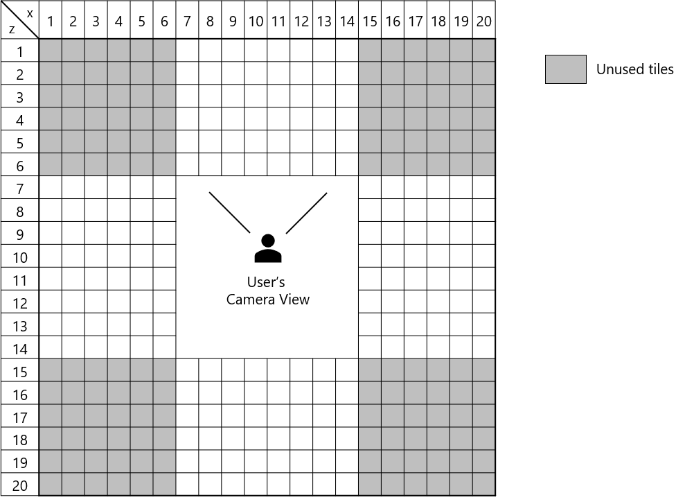

In this devised grid system, the **column indexes are the x axis in SparkAR and row indices are z axis in SparkAR**. This is aligned with the SparkAR dimensions where x is the width and z is the depth from the user’s perspective. Each box represents the **space needed for a single tile (unit length)**.

> *From our experiments, we have concluded that all game tiles should only be placed in the white/yellow boxes. Any tile placed within [x: 7, z: 7] to [x: 14, z: 14] would be at the user’s blind spot (too near to the user), and would only be visible if the player moves away from his/her original position.*

In the SparkAR environment, we will need a reference point for our grid, so let’s use the top-left corner i.e. [x: 1, y: 1]. The exact coordinates for the reference point based on our experiments is **[x: -0.463, y: -0.8, z: -0.52]**. We have also pre-determined that the **unit length is 0.15**, after including a small padding between tiles.

With the reference point and unit length, we can render a tile at any of the boxes in the grid simply by using the grid indexes. For example, if I want to place a tile at [x: 10, z: 5] on the grid, I can calculate the exact coordinates in SparkAR by **multiplying the grid index with our unit length**, and then **adding the reference point coordinate**.

Hence, the exact coordinates in SparkAR for a tile at [x: 10, z: 5] on our grid would be [x: 10 * 0.15 + (-0.463), z: 5 * 0.15 + (-0.52)].

</details>

### b. Level Design

After understanding the Grid System, we can start creating our first level! 

Here’s a sneak peek on the level design:

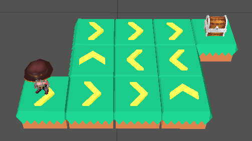

<details><summary>Show Instructions</summary>

The pirate begins from the lower left tile and ends at the upper right tile. The positions of the 9 tiles in the middle will be randomized before every attempt. Let’s draft this level design in our grid:


Usually, we start our level design with the solution in mind, before deciding which tiles should be shuffled. For our first level, we will shuffle the 9 tiles between [x: 10, z: 4] to [x: 12, z: 6]. The only fixed tiles are the starting tile at [x: 9, z: 6] and the destination tile at [x: 13, z: 4].

That will be all for our first level. Let’s move on to the scripting!

</details>

### c. Mapping Spark AR Objects to JavaScript Objects

We will now map objects on both the Studio and code together.

<details><summary>Show Instructions</summary>

In your Spark AR Studio, click on **Add Asset** > **Script**. You should see a new `script.js` under your assets. Navigate to your project directory and you should see a **scripts** folder with `script.js` within. This file will be the main script containing all of our game logic. Within the **scripts** folder, create a file named `levels.js`. This file will contain our level data, which will be imported by the main script later on. Open `levels.js` using your favourite editor and insert the following lines:

```js
module.exports = [
    {
        no_of_tiles: 9,
        start_tile: {
            name: "tileStart",
            direction: "right",
            units : 1,
            position: [2,8]
        },
        end_tile:{
            name: "tileEnd",
            position: [6,6]
        },
        tile_patterns: [
            {
                name: "tile1",
                direction: "right",
                units: 1
            },
            {
                name: "tile2",
                direction: "right",
                units: 1
            },
            {
                name: "tile3",
                direction: "up",
                units: 1
            },
            {
                name: "tile4",
                direction: "up",
                units: 1
            },
            {
                name: "tile5",
                direction: "left",
                units: 1
            },
            {
                name: "tile6",
                direction: "left",
                units: 1
            },
            {
                name: "tile7",
                direction: "right",
                units: 1
            },
            {
                name: "tile8",
                direction: "right",
                units: 1
            },
            {
                name: "tile9",
                direction: "right",
                units: 1
            },
        ],
        tile_positions_to_randomize: [
            [3,8], [4,8], [5,8], [3,7], [4,7], [5,7], [3,6], [4,6], [5,6]
        ],
    }
]
```

Let’s try to understand the above code. Here, we are exporting an array of objects, each object representing a game level. There is only 1 object in the array for now since we are working on our first level. Within the level object, there are a few properties:
- `no_of_tiles`: Total number of tiles
- `start_tile`: Where the pirate starts from
- `name`: Spark AR object name
- `direction`: Where the arrow on the tile is pointing towards
- `units`: How many tiles to move the pirate when stepped on
- `position`: Tile position on the grid system
- `end_tile`: Where the treasure chest is 
- `tile_patterns`: Every other tile besides start and end tile
- `tile_positions_to_randomize`: Grid indexes to render random tile patterns at

Essentially, the purpose of `levels.js` is to easily declare the structure of a level in our grid system so that we can render the SparkAR objects in `script.js`.

</details>

### d. Rendering the Level

With our `levels.js` ready, we can now start writing the main script. 

<details><summary>Show Instructions</summary>

Navigate to the **scripts** folder in your project directory and open `script.js` with your favourite editor. Remove the existing code and insert the following:

```js
const Scene = require('Scene');
export const Diagnostics = require('Diagnostics');
```

Here, we are loading the Scene and Diagnostics module. The Scene module allows us to access the objects placed in our AR environment, while the Diagnostics module is for debugging purposes.

Next, let’s define constants for our tile dimensions based on the grid system:

```js
// Tile dimensions
const unit_length = 0.15; // x length and z length
const top_left_x = -0.463;
const top_left_y = -0.8;
const top_left_z = -0.52;
```

Then, we’ll import `level.js` and retrieve the data for level 1:

```js
// Level variables
const levels = require("./levels");
let current_level = 1;
let level = levels[current_level - 1]; // lv 1 is index 0
let no_of_tiles = level.no_of_tiles;
let tile_positions = level.tile_positions_to_randomize;
let tile_patterns = level.tile_patterns;
let start_tile = level.start_tile;
let end_tile = level.end_tile;
```

To render a tile in place, we first need to retrieve the respective SparkAR tile object. We will write a function to retrieve the SparkAR tile object based on the tile name provided in our `level.js`:

```js
async function getTileUI(name) {
    const level = await Scene.root.findFirst("level" + current_level);
    return level.findFirst(name);
}
```

Next, we will need a function to convert our grid system indexes into X and Z coordinates in SparkAR. The formula can be found at previous section [Positioning Tiles using Grid System](#a-positioning-tiles-using-grid-system).

```js
function getCoordinateXFromIndex(index) {
    return top_left_x + (index * unit_length);
}
 
function getCoordinateZFromIndex(index) {
    return top_left_z + (index * unit_length);
}
```

Now that we are able to retrieve the respective SparkAR tile object as well as compute its respective X and Z coordinates based on our grid system, we can write our function for placing tiles. This function takes in the `tile_pattern` JavaScript object as well as its grid `position`, retrieves its respective SparkAR object name, and places it in the specified location.

```js
async function placeTile(tile_pattern, position) {
    // Place tile in SparkAR
    const tile_UI = await getTileUI(tile_pattern.name);
    tile_UI.transform.x = getCoordinateXFromIndex(position[0]);
    tile_UI.transform.y = top_left_y;
    tile_UI.transform.z = getCoordinateZFromIndex(position[1]);
}
```

Let’s test the function! Place the start and end tiles by passing in `start_tile` and `end_tile` and their `position`s:

```js
// Place start and end tile
placeTile(start_tile, start_tile.position);
placeTile(end_tile, end_tile.position);
```

Go back to your SparkAR Studio, and click on **Restart** to reload the filter. You should see the following:

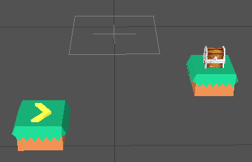

Hurray! We have successfully rendered the start and end tiles correctly. Next, we need to **render the middle nine tiles in a random fashion**. Let’s write a function that returns us a random array index given a maximum integer value. We will need this function to randomly select tiles to be placed.

```js
function getRandomInt(max) {
    return Math.floor(Math.random() * Math.floor(max));
}
```

To randomly render tiles, we will first loop through our `tile_patterns` variable, which contains all the tile patterns for the current level. For each tile pattern, we will use our random function to pick a random position on the grid to place the tile.

```js
// Place each tile in a random position
// Loop through tiles
tile_patterns.forEach(tile_pattern => {
    let randIndex = getRandomInt(tile_positions.length);
    let position = tile_positions[randIndex];
    tile_positions.splice(randIndex, 1);
 
    placeTile(tile_pattern, position);
})
```

Click on **Restart** in SparkAR Studio and you should see the entire level being rendered this time. Restart the filter a few more times, and you should notice that the tiles are being placed randomly.

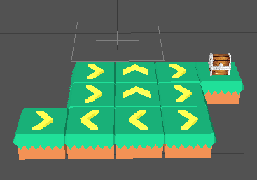

Next, we will need to place the pirate at the starting tile. Note that the pirate needs to stand at the center of the tile, so we will need a function that helps to calculate the coordinates of the center of a tile given a grid index. Since we previously wrote two functions to get the X and Z coordinates of a given index, we can simply reuse them.

```js
function getMidPointFromIndex(position) {
    return [
        getCoordinateXFromIndex(position[0]) - (unit_length / 2),
        getCoordinateZFromIndex(position[1]) + (unit_length / 2)
    ]
}
```

Now, we simply identify the pirate object in the SparkAR environment and position it accordingly.

```js
// Place character on start tile
Scene.root.findFirst("pirate")
    .then(agent => {
        let agentPosition = start_tile.position
        let point = getMidPointFromIndex(agentPosition);
        agent.transform.x = point[0];
        agent.transform.y = top_left_y + 0.11; // To ensure the pirate is at the right height
        agent.transform.z = point[1];
    })
```

Click on **Restart** in Spark AR Studio and you should see the pirate being placed in the center of the starting tile:

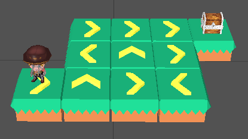

Great job! You have successfully rendered the level using scripting. In the next sections, we will work on handling user interactions, such as tapping on a single tile to select it, tapping on two tiles to swap them, and tapping on the pirate to start walking.

</details>

### e. Selecting Tiles

When the player selects a tile, there should be some form of indication to show that he/she has selected the tile he/she wanted to choose. In order to do so, we will create a function `animateTileSelect` to elevate the tile slightly when it is being selected, and also return it to its original position when it is being selected again.

<details><summary>Show Instructions</summary>

First, let’s add the `Animation` and `TouchGestures` library to our imports:

```js
// Imports
const Scene = require('Scene');
export const Diagnostics = require('Diagnostics');
const Animation = require('Animation');
const TouchGestures = require("TouchGestures");
```

Since all animations require a `TimeDriver`, we’ll create a function that returns a default `TimeDriver` with **duration 200** and **loop count 1**:

```js
// Animations
function getTimeDriver(duration = 200, loopCount = 1, mirror = false) {
    return Animation.timeDriver({
        durationMilliseconds: duration,
        loopCount: loopCount,
        mirror: mirror
    });
}
```

Next, we’ll also use a boolean variable to keep track if a tile is animating. We will need this to ensure when a tile is animating, no other tiles can have any interaction with the user. This is to prevent issues when a user presses multiple tiles quickly. In addition, we will need a variable to store the selected tile.

```js
// Gameflow variables
let tile_is_animating = false;
let selection = null; // store any selected tile (for swapping)
```

Let’s now complete the animation function for tile selection. The animation will be a simple linear elevation and lowering when the tile is being selected and selected for the second time respectively.

```js
function animateTileSelect(tile, animation) {
    const tdTileMove = getTimeDriver();
 
    let y_value = tile.transform.y.pinLastValue();
    y_value = animation === "active" ? y_value + 0.02 : y_value - 0.02;
 
    tile.transform.y = Animation.animate(
        tdTileMove,
        Animation.samplers.linear(tile.transform.y.pinLastValue(), y_value);
    );
 
    tile_is_animating = true
    tdTileMove.start();
    tdTileMove.onCompleted().subscribe(function() {
        tile_is_animating = false;
    })
}
```

To trigger the animation, we will need a **subscriber** to an `onTap` event for each tile. We will need to access the SparkAR object for this, so let’s modify the previous code we have written. When we iterate over the tiles for rendering, we will retrieve the respective SparkAR tile object and add a **tap event subscriber**. When a tile is selected, it elevates its position and changes from “blur” to “active” state. Conversely, when a selected tile is selected again, it changes from “active” back to “blur” state and returns to its original position.

```js
// Place each tile in a random position
// Loop through tiles
Scene.root.findFirst("level_" + current_level)
    .then(level => {
        tile_patterns.forEach(tile_pattern => {
            let randIndex = getRandomInt(tile_positions.length);
            let position = tile_positions[randIndex];
            tile_positions.splice(randIndex, 1);
 
            placeTile(tile_pattern, position);
 
            level.findFirst(tile_pattern.name)
                .then(tile_UI => {
                    // For each tile, prepare listener for tap event
                    TouchGestures.onTap(tile_UI).subscribe(function () {
                        if (!tile_is_animating) {
                            if (selection === null) {
                                // if there is no active tile
                                selection = tile_UI;
                                animateTileSelect(tile_UI, "active");
                            } else {
                                // if active tile is same as selection, de-select tile
                                if (tile_UI === selection) {
                                    animateTileSelect(tile_UI, "blur");
                                    selection = null;
                                }
                            }
                        }
                    });
                })
        })
    })
```

Run the filter and tap on any tile, you should see the tile elevating slightly:

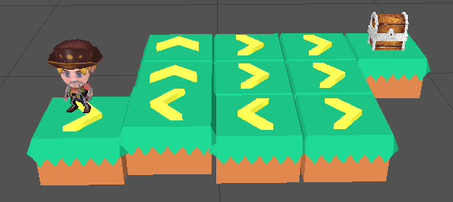

</details>

### f. Swapping Tiles

When two swappable tiles are selected, tiles swapping will occur. Before we can do so, we will need to keep track of the position of each tile. 

<details><summary>Show Instructions</summary>

We will create 2 variables as part of our level variables to store the mapping of each tile to its grid position, as well as a reversed mapping of each grid position to its respective tile.

```js
// Level variables
const levels = require("./levels");
let current_level = 1;
...
let position_tiles = {};
let tiles_position = {};
```

Next, we will modify our placeTiles function to update the 2 variables:

```js
async function placeTile(tile_pattern, position) {
 
    // Place tile in position_tiles and tiles_position
    position_tiles[position] = tile_pattern;
    tiles_position[tile_pattern.name] = position;
 
    // Place tile in SparkAR
    const tile_UI = await getTileUI(tile_pattern.name);
    tile_UI.transform.x = getCoordinateXFromIndex(position[0]);
    tile_UI.transform.y = top_left_y;
    tile_UI.transform.z = getCoordinateZFromIndex(position[1]);
}
```

We will also need a gameflow variable to keep track of the position of the selected tile:

```js
// Gameflow variables
let tile_is_animating = false
let selection = null; // store any selected tile (for swapping)
let selection_position = null
```

Similarly, let’s modify our subscriber for tile selection to update the selection_position variable:

```js
// For each tile, prepare listener for tap event
TouchGestures.onTap(tile_UI).subscribe(function () {
    if (!tile_is_animating) {
        if (selection === null) {
            // if there is no active tile
            selection = tile_UI;
            selection_position = tiles_position[tile_pattern.name];
            animateTileSelect(tile_UI, "active");
        } else {
            // if active tile is same as selection, de-select tile
            if (tile_UI === selection) {
                animateTileSelect(tile_UI, "blur");
                selection = null;
                selection_position = null;
            }
            // swap tiles
            else {
                swapTiles(selection_position, tiles_position[tile_pattern.name], selection, tile_UI)
                animateTileSelect(selection, "blur");
                selection = null;
                selection_position = null;
            }
        }
    }
});
```

Previously, we had set up a listener in the previous section to listen for a tap event with `TouchGestures.onTap`, and a function that will be called in the subscribe method. Let us now modify by **adding an else block** after the if block that deselects a tile. The tiles should be deselected and “locked in” to the environment after the tile swap.

```js
// For each tile, prepare listener for tap event
TouchGestures.onTap(tile_UI).subscribe(function () {
    if (!ready) {       
        if (!tile_is_animating) {
            ...
            } else {
                // if active tile is same as selection, de-select tile
                if (tile_UI === selection) {
                    ...
                }
                // swap tiles
                else {
                    swapTiles(selection_position, tiles_position[tile_pattern.name], selection, tile_UI);
                    animateTileSelect(selection, "blur");
                    selection = null;
                    selection_position = null;
                }
            }
        }
    }
});
```

Let us dive deeper into the `swapTiles` function. First, we will need to **identify the tile representations** in the selected position and **swap them in the position to tile mappings**. After changing the underlying representations, the game environment will change, where the tiles shown in the screen get a **swap animation** with `animateTileSwap`.

```js
async function placeTile(tile_pattern, position) {
    ...
}
 
async function swapTiles(position_1, position_2, selection, tile_UI) {
    let tile_pattern_1 = position_tiles[position_1];
    let tile_pattern_2 = position_tiles[position_2];
    
    // Swap tiles
    position_tiles[position_1] = tile_pattern_2;
    tiles_position[tile_pattern_2.name] = position_1;
    position_tiles[position_2] = tile_pattern_1;
    tiles_position[tile_pattern_1.name] = position_2;
 
    animateTileSwap(selection, tile_UI);
}
```

```js
function animateTileSwap(tile1, tile2) {
    const tdTileSwap = getTimeDriver();
 
    let tile1x = tile1.transform.x.lastValue;
    let tile1z = tile1.transform.z.lastValue;
    tile1.transform.x = shiftx(tdTileSwap, tile1, tile2.transform.x.lastValue);
    tile1.transform.z = shiftz(tdTileSwap, tile1, tile2.transform.z.lastValue);
    tile2.transform.x = shiftx(tdTileSwap, tile2, tile1x);
    tile2.transform.z = shiftz(tdTileSwap, tile2, tile1z);
    tile_is_animating = true;
    tdTileSwap.start();
    tdTileSwap.onCompleted().subscribe(function() {
        tile_is_animating = false;
    })
}
```

The `shiftx` and `shiftz` functions are separated for reusability.

```js
const shiftx = (td, obj, destination) =>
    Animation.animate(td, Animation.samplers.linear(obj.transform.x.pinLastValue(), destination));
 
const shiftz = (td, obj, destination) =>
    Animation.animate(td, Animation.samplers.linear(obj.transform.z.pinLastValue(), destination));
```

</details>

### g. Shifting the Pirate from One Tile to Another

After swapping tiles, the player is confident that the route to the treasure is created. But before starting the game, we have to work on the game mechanics after the game starts. 

<details><summary>Show Instructions</summary>

Firstly, the pirate is not allowed to revisit the same tile twice, as it will result in an endless loop. To prevent this, we will use a variable to track the tiles that have been visited:

```js
// Level variables
const levels = require("./levels");
...
let position_tiles = {};
let tiles_position = {};
let position_visited = {};
```

We will also need variables to track if a player has won or lost at any time during the game:

```js
// Gameflow variables
let tile_is_animating = false;
...
let player_win = false;
let player_lost = false;
```

Next, let’s create the `moveAgent` function, which will determine and move the pirate to the next tile based on the current tile he is stepping on. This function will be called at every step. The player wins whenever the pirate steps on the end tile, and loses whenever the pirate steps off the grid or revisits a tile. 

```js
function moveAgent(agent, agentPosition) {
    let direction = position_tiles[agentPosition].direction;
    position_visited[agentPosition] = true;
    
    let destinationPosition = null;
    if (direction == "left") {
        destinationPosition = [agentPosition[0] - 1, agentPosition[1]];
    } else if (direction == "right") {
        destinationPosition = [agentPosition[0] + 1, agentPosition[1]];
    } else if (direction == "up") {
        destinationPosition = [agentPosition[0], agentPosition[1] - 1];
    } else if (direction == "down") {
        destinationPosition = [agentPosition[0], agentPosition[1] + 1];
    }
 
    if (destinationPosition == null || position_tiles[destinationPosition] == null) {
        Diagnostics.log("Invalid move");
        player_lost = true;
        return agentPosition;
    } else if (position_visited[destinationPosition]) {
        Diagnostics.log("Moved backwards");
        player_lost = true;
        return agentPosition;
    }
 
    // Check for win state
    if (destinationPosition[0] === end_tile.position[0] && destinationPosition[1] === end_tile.position[1]) {
        Diagnostics.log("Reached chest!");
    }
 
    return destinationPosition;
}
```

</details>

### h. Starting the Game

Great job following through the various gameplay elements, now you are ready to start the game!
 
<details><summary>Show Instructions</summary>

We have made the trigger to start the game really intuitive - the player only has to tap on the pirate. To do so, we implement a `TouchGestures.onTap` listener on the pirate object, and the function inside the subscribe method will be called when the pirate is tapped. We check if the player has lost, or if the pirate is at the ending position. If the condition evaluates to false, the game starts and the `moveAgent` function is called at every 1 second (1000ms) interval.

Since we are invoking a function in interval, we need to import the `Time` library:

```js
const Time = require("Time");
```

We will also need a gameflow variable to track if the game has started i.e. the player has tapped on the pirate:

```js
// Gameflow variables
let tile_is_animating = false;
...
let ready = false;
```

Finally, we can add the **tap event subscriber** to call the `moveAgent` function:

```js
// Place character on start tile
Scene.root.findFirst("pirate")
    .then(agent => {
        let agentPosition = start_tile.position;
        ...
 
        // Listen for tap on character
        TouchGestures.onTap(agent).subscribe(function (gesture) {
            Diagnostics.log("Starting game");
            ready = true;
            Time.setInterval(() => {
                if (!player_lost && (agentPosition[0] !== end_tile.position[0] || agentPosition[1] !== end_tile.position[1])) {
                    agentPosition = moveAgent(agent, agentPosition);
                }
            }, 1000);
        });
 
        Diagnostics.log("Agent loaded");
    })
```

Restart the filter, swap the tiles to the correct positions and tap on the pirate. Did the pirate move from tile to tile, eventually to the treasure (if you got the right path)? What’s missing?

</details>

## 5. Part 3: Giving Life to the Pirate

Let’s bring the pirate to life! To do so, an animation playback controller is needed for each animation. The patch editor will link the animations to the options on the option picker s as to control the pirate’s animation from the script. 

After animating the pirate, we will then make the pirate rotate towards the direction he is moving towards.

> The objective of this section is to implement movements to make the character in the game move - giving it lifelike animations. This is crucial in many AR experiences, augmenting reality by introducing new 3D objects into the scene and making them feel lifelike.

### a. Adding Animations

We will add three types of animation for the pirate.

<details><summary>Show Instructions</summary>

We will first add the **idle** animation.

1. Under the Assets panel, click on **Add Asset** > **Animation Playback Controller**.
2. Rename the animation playback controller to `pirate_idle`.
3. In the Inspector (the panel on the right), select **idle** from the Animation Clip dropdown box.

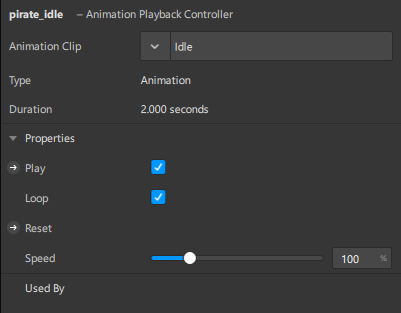

Repeat the same steps for the **walk** and **crash** animation, naming the animation playback controllers `pirate_walk` and `pirate_crash` respectively.

Now, let us link the animations together using the Patch Editor. 

1. To show the Patch Editor, select **View** on the menu bar, then select **Show/Hide Patch Editor**. The Patch Editor will be shown on the bottom middle of the Spark AR window.
2. On the bottom right of the Patch Editor, click on **Add Patch**. 
3. In the pop up, select **Utility** > **Option Picker**, then click on **Add Patch**. 
4. Below the Option Picker patch, select the type to be **Animation Data**. 

To control the pirate’s animation, the Animation Target patch for the pirate object must be added. 
1. Select the **pirate** object in the Scene panel, then in the Inspector, **select the arrow (pointing to the right) on the left of Animation**. 
2. To link the Option Picker with the Animation Target, **click and hold the output port of the Option Picker**, and **drag across to the input port** of the Animation Target.

To control the options (via `script.js`), a **Variables from Script** patch is used. 
1. In the Assets panel under Script, click on **script.js**. 
2. In the Inspector, **click the + button to the right of From Script and select Number**.
3. Change the variable name from `scriptToEditorVar` to `pirate_animation`. Remember this variable name as it will be used in the script. 
4. Right click on **scripts.js** and click **Create Patch**. 
5. Link the **Variables from Script** patch to the first input port of the **Option Picker**.

In the Assets panel, drag the pirate_idle, pirate_walk and pirate_crash animation playback controllers to the Patch Editor, and **link the corresponding Animation patches** to the second, third and fourth input ports of the Option Picker patch respectively. The option number for each animation corresponds to the input port of the Option Picker patch (and since the default option is 0, the default animation is the idle animation).

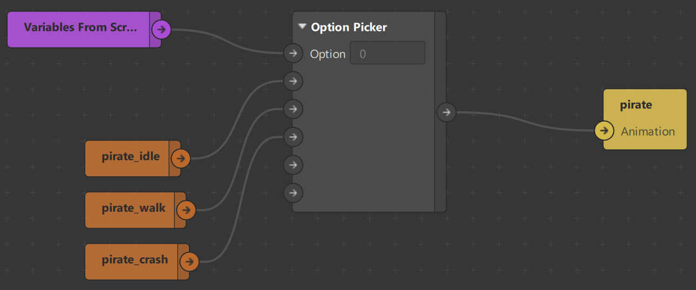

Now changing between animations can be scripted in `scripts.js` with `Patches.inputs.setScalar`. Add the `Patches` module as a dependency.

```js
const Patches = require('Patches');
```

Set the animation to **idle** (option 0) where the pirate object is found in the scene.

```js
// Place character on start tile
Scene.root.findFirst("pirate")
    .then(agent => {
        let agentPosition = start_tile.position;
        ...

        // Set agent animation clip to idle
        Patches.inputs.setScalar('pirate_animation', 0);

        // Listen for tap on character
        ...
    })
```

Set the animation to **walk** (option 1) in a new function `animateMoveAgent`, which will be called when the pirate takes a step. After each step, reset the animation to idle.

```js
function animateMoveAgent(agent, destinationPosition, direction) {
    
    Patches.inputs.setScalar('pirate_animation', 1);

    // Animate agent towards direction
    const tdAgentMove = getTimeDriver(500);
    const point = getMidPointFromIndex(destinationPosition);

    agent.transform.x = shiftx(tdAgentMove, agent, point[0]);
    agent.transform.z = shiftz(tdAgentMove, agent, point[1]);
    tdAgentMove.start();
    Time.setTimeout(() => {
        // Set back to idle after each step
        if (!player_lost) {
            Patches.inputs.setScalar('pirate_animation', 0);
        }
    }, 500)

}
```

Add the call to `animateMoveAgent` in `moveAgent`.

```js
function moveAgent(agent, agentPosition) {
    ...
    } else if (direction == "down") {
        destinationPosition = [agentPosition[0], agentPosition[1] + 1];
    }
 
    animateMoveAgent(agent, destinationPosition, direction);
 
    if (destinationPosition == null || position_tiles[destinationPosition] == null) {
     ...
}
```

Set the animation to **crash** (option 2) when the pirate takes an invalid move, or when it moves backwards (to a visited tile) in `moveAgent`. The `moveAgent` function is called when the pirate starts navigating from one tile to another (after being tapped on by the player).

```js
function moveAgent(agent, agentPosition) {
    let direction = position_tiles[agentPosition].direction;
    ...

    if (destinationPosition == null || position_tiles[destinationPosition] == null) {
        Diagnostics.log("Invalid move");
        player_lost = true;

        Time.setTimeout(() => {
            // Position to move toward is invalid - change to crash animation clip
            Patches.inputs.setScalar('pirate_animation', 2);
        }, 500)

        return agentPosition;
    } else if (position_visited[destinationPosition]) {
        Diagnostics.log("Moved backwards");
        player_lost = true;
        
        // Dead - Change to crash animation clip
        Time.setTimeout(() => {
            Patches.inputs.setScalar('pirate_animation', 2);
        }, 500)

        return agentPosition;
    }
    
    ...

    return destinationPosition;
}
```

Try starting the game and the pirate will be transitioning between animations and moving from tile to tile.

</details>

### b. Rotating the Pirate

Last but not least, we need to ensure the pirate is facing the right direction! Let us add a new variable player_direction to store the pirate’s direction. 

<details><summary>Show Instructions</summary>

The default direction would be **down**, as the pirate is facing the player.

```js
// Gameflow variables
let player_direction = "down"
```

Then, add an if block in `animateMoveAgent` to check if the direction is the same as the player’s direction. If it isn't, rotate the agent with a new function `animateRotateAgent`.

```js
function animateMoveAgent(agent, destinationPosition, direction) {
    Patches.inputs.setScalar('pirate_animation', 1)
 
    // Rotate agent to face direction
    if (direction !== player_direction) {
        animateRotateAgent(agent, direction);
        player_direction = direction;
    }
 
    // Animate agent towards direction
    const tdAgentMove = getTimeDriver(500);
    ...
}
```

The `animateRotateAgent` function is created to implement the animation with `Animation.animate`.

```js
function animateRotateAgent(agent, direction) {
    const tdRotateAgent = getTimeDriver();
    let angles = {
        "up": degreesToRadians(180),
        "down": degreesToRadians(0),
        "right": degreesToRadians(90),
        "left": degreesToRadians(270)
    }
 
    agent.transform.rotationY = Animation.animate(
        tdRotateAgent,
        Animation.samplers.linear(angles[player_direction], angles[direction])
    )
    tdRotateAgent.start()
}
```

The second argument of `Animation.animate` - the linear animation `Animation.samplers.linear` function takes in the radian values of the current and targeted angles. Thus, the following `degreeToRadians` function converts the values.

```js
function degreesToRadians(degrees) {
    let pi = Math.PI;
    return degrees * (pi / 180);
}
```

</details> 

### c. Starting the Game

And that's it! Try starting the game and the pirate will both be transitioning between animations and rotating when moving from one tile to another!

## 6. Scaling It Up

Congratulations! You have picked up the necessary skills and concepts to develop your own puzzle filter. However, there is more that can be done to make the game more fun and exciting. If you are looking to take up the challenge, we have two tasks prepared for you.

> Note: At any time that you are stuck on these challenges, you can refer to our [**Pirate Dash 360**](https://github.com/yankai364/Pirate-Dash-360) repository.

### a. Challenge 1: Creating Multiple Levels
To introduce a 360 degree experience in the game, one could opt to create multiple levels, surrounding the player in question. An illustration can be seen below:

<p align="center"></p>

In order to facilitate multiple levels, you can use a JSON file to pre-customize the setups of the different levels.

Additionally, you can add instructions and directional signs to navigate the player from one level to another.

### b. Challenge 2: Adding Multiple Worlds

For **Pirate Dash 360**, we implemented three different themes - Grass World, Snow World, Desert World - to vary the level of difficulty of the game.

<p align="center">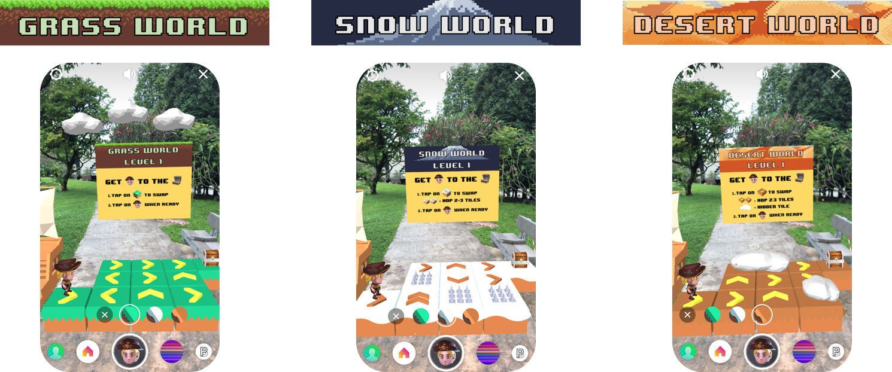</p>

If you wish to add multiple themes as well, you can implement a native UI slider, reflecting different worlds and themes in the game. You can check out the [Native UI Slider Tutorial](https://sparkar.facebook.com/ar-studio/learn/tutorials/native-ui-slider/)  for more information. 

For a more immersive experience, try adding effects like snow and sandstorm with [particle systems](https://sparkar.facebook.com/ar-studio/learn/tutorials/adding-particle-systems/)!

## 7. Optional: Publishing the Filter 

Once you are ready, you may publish the filter!

<details><summary>Show Instructions</summary>

1. Click on **Upload and Export** on the leftmost panel.

<p align="center">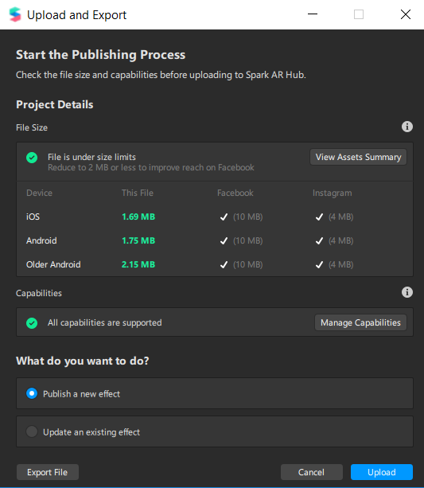</p>

2. The file size will be calculated and if it meets the requirement for Facebook (2 MB) and Instagram (4 MB), a green tick stating that it is Ready to Submit will appear. Click on **Export** to export the filter. Save the file on your local PC.

3. Once the file is saved, prepare a demo video (maximum 32 MB) that will help a user understand how the filter can be used. The video can be recorded when you start the preview on Spark AR Studio. Some tips on how to prepare the demo video can be found [here](https://sparkar.facebook.com/ar-studio/learn/publishing/demo-videos-for-instagram-effects/#demo-video-recommendations).

4. Also, prepare a mini icon that represents the filter (minimum 200 x 200 pixels).

5. Head to https://www.facebook.com/sparkarhub/ and log into your Facebook/Instagram account to access the Spark AR Hub dashboard. Click on **Publish an Effect** on the left panel.

<p align="center">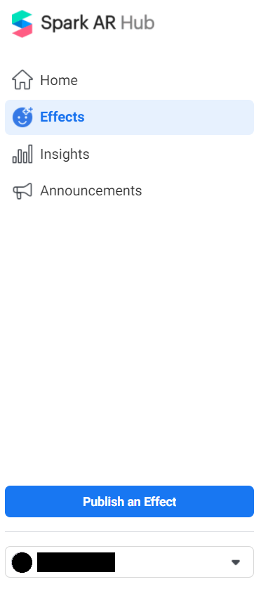</p>

6. Fill in a name for the effect, and upload the AR Project file you saved earlier. Choose the platform that you want to publish the effect to, and select the owner and Instagram account (if Instagram is selected) associated with this effect. You may also add up to 20 keywords that are related to the effect, so that other users can find your filter easily.

<p align="center">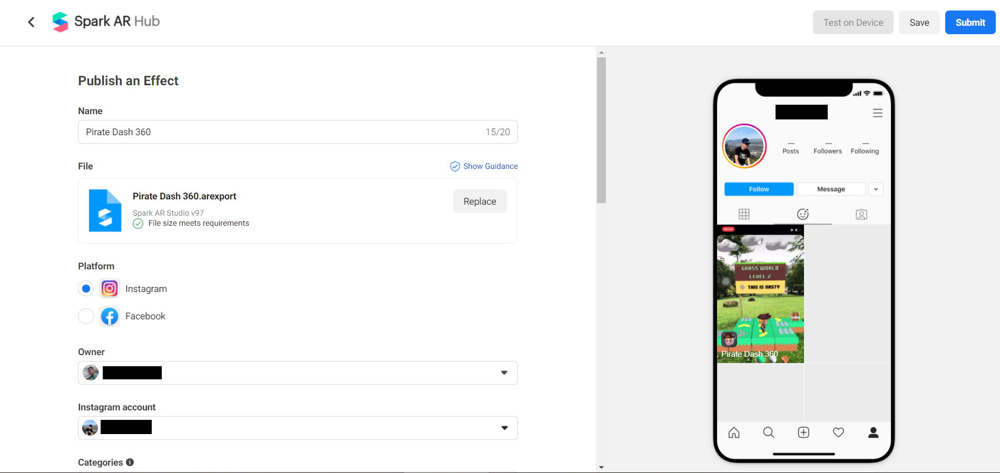</p>

7. Once everything is filled up, hit on **Submit**!

<p align="center">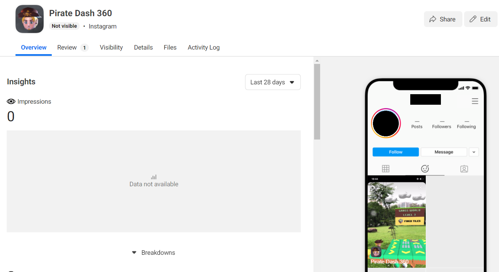</p>

And that’s it! You will receive a notification when your filter is approved. 

</details>

## 8. What's Next

The skills that you have picked up through our tutorial can be used to develop your own applications. You may draw inspirations from:

- Rush Hour or Unblock Me 
- Bejeweled or Candy Crush
- Otello
- Go
- Checkers
- Or anything creative/new that you might think of, just like **Pirate Dash 360**!

> Note: Make sure to check for any copyright infringements before developing new versions of existing games.

<p align="center">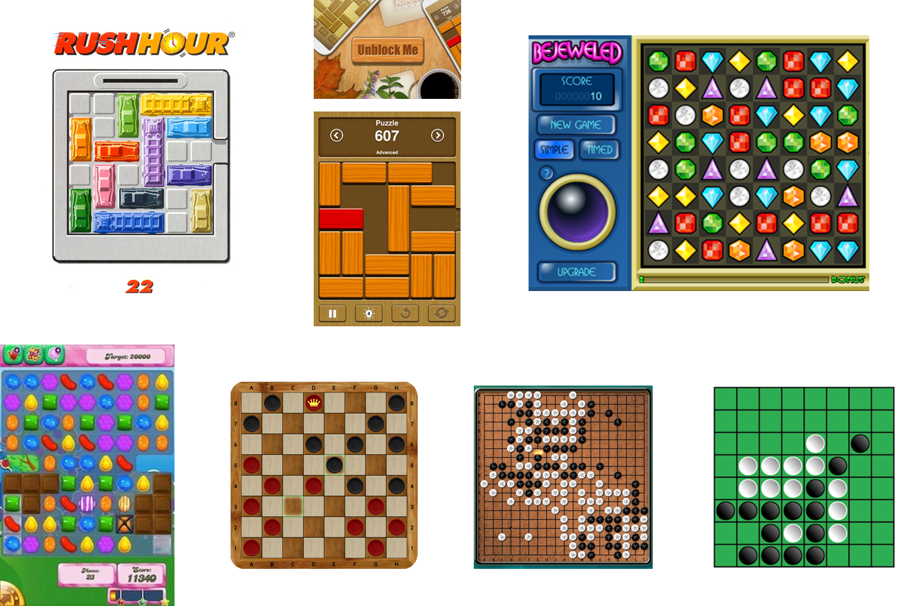</p>

## 9. Appendices, References, Credits

### 9.1. Pirate Dash 360
- [Pirate Dash 360 Repository](https://github.com/yankai364/Pirate-Dash-360)

### **9.2. Spark AR Studio Fundamentals**
- [Using Spark AR Studio](https://sparkar.facebook.com/ar-studio/learn/articles/fundamentals/navigating-the-interface)

### **9.3. Importing and Customizing Game Assets**
- [Adding Objects and Assets](https://sparkar.facebook.com/ar-studio/learn/articles/fundamentals/adding-objects-and-assets/#how-objects-and-assets-work-together)

- [Working with Textures and Materials](https://sparkar.facebook.com/ar-studio/learn/tutorials/working-with-textures-and-materials/#creating-material)

### **9.4. Creating the Augmented Environment**
- [Scripting Basics](https://sparkar.facebook.com/ar-studio/learn/scripting/scripting-basics#creating-a-script)

- [SparkAR API/Modules Documentation](https://sparkar.facebook.com/ar-studio/learn/reference/scripting/summary)

### **9.5. Animating the Pirate**

- [Animating 3D Objects](https://sparkar.facebook.com/ar-studio/learn/tutorials/3d-objects-animation/)

- [Patch Editor](https://sparkar.facebook.com/ar-studio/learn/patch-editor)

- [Script to Patch Editor Bridging](https://sparkar.facebook.com/ar-studio/learn/patch-editor/bridging)

### **9.6. Adding Multiple Worlds**

- [Native UI Slider](https://sparkar.facebook.com/ar-studio/learn/tutorials/native-ui-slider/)

- [Creating World Effects](https://sparkar.facebook.com/ar-studio/learn/tutorials/particle-world-effect)

### **9.7 Publishing Filter**

-  [Publishing Effects](https://sparkar.facebook.com/ar-studio/learn/publishing/publishing-your-spark-ar-effect)

- [Requirements for Demo Videos](https://sparkar.facebook.com/ar-studio/learn/publishing/demo-videos-for-instagram-effects/#demo-video-recommendations)

### **9.8 Game Assets and Sound Effects**

- [SketchFab](https://sketchfab.com)
- [Kenney](https://www.kenney.nl/assets)
- [Quaternius.Itch.IO](https://quaternius.itch.io)
- Facebook Sound Design
- Global Genius

---
*Last Updated on 26 October 2020*
